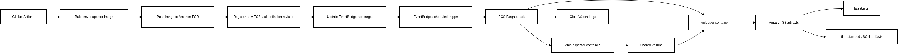

# Env Inspector – Containerized Automation Platform

`env-inspector` is a production-style DevOps automation project built on AWS with containerized tooling, CI/CD deployment, scheduled execution, artifact storage, and runtime traceability.

The platform builds a containerized automation tool, deploys it through GitHub Actions, runs it on AWS Fargate, and stores execution artifacts in Amazon S3.


## Overview

This project demonstrates how to build and operate a scheduled container automation platform using:

- Amazon ECS
- AWS Fargate
- Amazon EventBridge
- Amazon ECR
- Amazon S3
- Amazon CloudWatch Logs
- GitHub Actions
- Terraform

The system supports both scheduled execution and manual execution of the same containerized automation workflow.


## What This Project Does

The `env-inspector` container collects runtime environment data and produces a JSON artifact. A second `uploader` container copies that artifact to S3, where it is stored both as a timestamped record and as a rolling `latest.json`.

The platform also captures deployment and runtime traceability metadata, including:

- Git commit SHA
- ECS task definition ARN
- ECS task ARN
- run source

This makes each artifact auditable: you can tell what code produced it, what task definition ran it, and which ECS task executed it.


## Architecture

See `docs/architecture.txt` for the full diagram.



### High-level flow

1. GitHub Actions authenticates to AWS using OIDC
2. CI builds the `env-inspector` container image
3. CI pushes the image to Amazon ECR using an immutable git-SHA tag
4. CI registers a new ECS task definition revision
5. CI updates the EventBridge target to use the new task definition
6. EventBridge triggers the ECS Fargate task on schedule
7. `env-inspector` collects environment data and writes JSON output to a shared volume
8. `uploader` copies the artifact to Amazon S3
9. CloudWatch Logs capture execution output for visibility and debugging


## Deployment Flow

```text
git push
  ↓
GitHub Actions builds container
  ↓
Image pushed to Amazon ECR
  ↓
New ECS task definition revision registered
  ↓
EventBridge target updated to new revision
  ↓
Scheduled Fargate task runs container
  ↓
Automation output stored in S3
