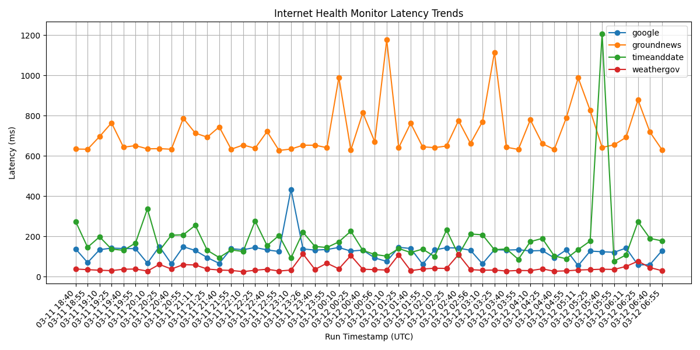

# Internet Health Monitor

Internet Health Monitor is a containerized AWS monitoring platform that performs scheduled HTTP health checks, measures latency, classifies service condition, and publishes historical observability artifacts for operator review.

Built as part of my transition into DevOps and cloud engineering, this project demonstrates that I can design, deploy, troubleshoot, and improve a real scheduled workload on AWS rather than only write local scripts.

---

## Portfolio Summary

This project demonstrates hands-on work with:

- Python
- Docker
- AWS ECS Fargate
- Amazon EventBridge Scheduler
- Amazon S3
- Amazon CloudWatch Logs
- Amazon ECR
- Terraform

The platform runs on a schedule, checks configured web targets, records latency and response-validation results, generates operator-friendly artifacts, preserves historical run data, and publishes outputs for later review.

---

## What This Project Does

For each scheduled run, the application:

1. loads monitoring targets from YAML configuration
2. performs HTTP checks against each target
3. measures response latency
4. validates expected HTTP status codes
5. classifies each target as healthy, degraded, or unhealthy
6. generates JSON and text output artifacts
7. stores historical results for trend analysis
8. builds a latency trend chart from prior runs
9. uploads artifacts to Amazon S3
10. emits execution logs to CloudWatch

This creates both current-state visibility and historical observability.

---

## Why This Project Matters

A basic website checker can print whether a site is up or down.

This project goes further by treating monitoring as an operational platform component:

- scheduled cloud execution instead of manual local runs
- containerized packaging and deployment
- structured artifact generation
- historical record retention
- chart-based trend visibility
- operator-readable reporting
- infrastructure managed with Terraform
- iterative debugging of real deployment issues

That makes it much closer to the way internal monitoring and automation tools are handled in real engineering environments.

---

## Architecture Summary

The workload is packaged as a Docker container and deployed to AWS.

- **Amazon ECR** stores the container image
- **Amazon ECS Fargate** runs the monitoring task
- **Amazon EventBridge Scheduler** triggers recurring executions
- **Amazon S3** stores latest and historical artifacts
- **Amazon CloudWatch Logs** provides runtime visibility
- **Terraform** manages the infrastructure configuration

The application itself is organized around a small monitoring pipeline:

- target loading
- target checking
- result modeling
- report generation
- artifact storage
- history loading
- latency chart generation

---

## Features

- multi-target HTTP health checks
- latency measurement per target
- expected-status validation
- health-state classification
- latest artifact generation
- historical artifact retention
- latency trend chart generation
- S3 artifact publishing
- YAML-based target configuration
- scheduled AWS execution

---

## Sample Chart



This sample image represents the style of latency trend artifact generated by the monitoring platform from stored run history.

---

## Example Outputs

The repository includes curated sample artifacts to show the reporting format without cluttering the project with generated runtime output.

### Sample artifacts

- `artifacts/examples/sample-results.json`
- `artifacts/examples/sample-report.txt`

In deployed operation, the platform also produces:

- latest result artifacts
- latest text reports
- latency trend charts
- date-organized historical result data for trend reconstruction

---

## Repository Structure

```text
.
├── app/
│   ├── checker.py
│   ├── chart_main.py
│   ├── charting.py
│   ├── history_loader.py
│   ├── main.py
│   ├── models.py
│   ├── report.py
│   └── storage.py
├── artifacts/
│   └── examples/
├── config/
│   └── targets.yaml
├── images/
├── infra/
│   └── environments/dev/
├── Dockerfile
├── requirements.txt
└── README.md
```

---

## What I Learned Building This

This project became more valuable because of the troubleshooting and iteration, not just the initial build.

### DevOps and Cloud Lessons

- how to package a Python workload into a repeatable Docker container
- how ECS task definitions, container images, environment variables, and scheduled execution need to stay aligned
- how to use EventBridge Scheduler to run recurring workloads without managing servers
- how to use S3 not just for storage, but as part of an artifact pipeline
- how CloudWatch logs help diagnose what actually happened in remote scheduled runs
- how Terraform helps structure and repeat cloud infrastructure changes

### Operational Lessons

- the difference between code that works locally and code that works in the deployed runtime
- how small path and import mistakes can break containerized execution
- how artifact path design affects chart generation and historical visibility
- how environment-aware storage paths matter when separating dev behavior from deployed behavior
- how to debug missing outputs by checking logs, task behavior, and artifact timestamps instead of guessing
- how to preserve working baselines while iterating on new features

### Engineering Lessons

- how to add chart generation without breaking the existing reporting pipeline
- how to refactor a project into clearer application modules
- how to think about operator experience, not just raw output data
- how to turn a simple script idea into a portfolio project that shows platform thinking

---

## Recruiter-Relevant Skills Demonstrated

This project reflects hands-on experience with:

- containerized application packaging
- scheduled cloud automation
- infrastructure as code
- runtime troubleshooting
- artifact pipeline design
- observability workflows
- AWS service integration
- production-style debugging and iteration
- documentation and operator-facing presentation

---

## Monitored Targets

Targets are defined in `config/targets.yaml` and can be changed without modifying application logic.

Example monitored services in the current project include public web endpoints such as:

- Google
- TimeAndDate
- Ground News
- Weather.gov

---

## AWS Services Used

- **Amazon ECS Fargate** for container execution
- **Amazon EventBridge Scheduler** for recurring runs
- **Amazon S3** for artifact publishing and history retention
- **Amazon CloudWatch Logs** for execution visibility
- **Amazon ECR** for image storage
- **IAM** for task and execution permissions

---

## Infrastructure as Code

Infrastructure is managed with Terraform using an environment-based layout.

This project includes:

- ECS task execution wiring
- scheduled task triggering
- IAM role and permission design
- S3-backed artifact integration
- environment-aware deployment structure

---

## Resume-Level Summary

Built a containerized Internet Health Monitor on AWS using Python, Docker, ECS Fargate, EventBridge Scheduler, S3, CloudWatch, ECR, and Terraform to perform scheduled HTTP checks, classify service health, preserve historical monitoring data, and generate latency trend artifacts for operational review.

---

## Status

Current state: **working, deployed, artifact-complete, and recruiter-ready**

The project now demonstrates both technical implementation and the kind of debugging, iteration, and operational thinking that are directly relevant to DevOps and cloud engineering roles.

