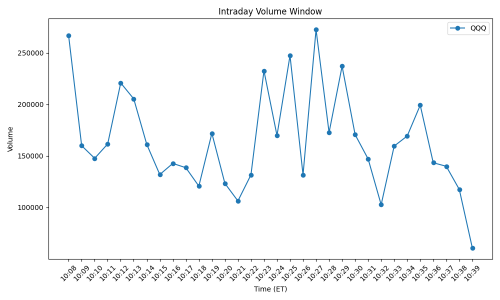

# Market Snapshot Bot

Market Snapshot Bot is a containerized AWS market-monitoring project built to demonstrate Python automation, scheduled cloud execution, artifact pipelines, and production-style operational troubleshooting.

This project began as a platform and infrastructure exercise to prove Docker packaging, ECS/Fargate task execution, EventBridge scheduling, CloudWatch visibility, and artifact generation. It then evolved into a real-data workflow project while deliberately preserving mock mode for safe development, testing, and rollback.

For a recruiter or hiring manager, the value of this project is not just that it produces charts and CSVs. The value is that it demonstrates the full lifecycle of a scheduled cloud workload: local development, containerization, task definition management, scheduler wiring, environment-aware behavior, artifact generation, and troubleshooting when runtime behavior does not match expectations.

---

## What This Project Demonstrates

- Python automation packaged for container execution
- Docker build workflow for repeatable deployment
- Amazon ECR image publishing
- Amazon ECS Fargate task execution
- Amazon EventBridge Scheduler recurring job orchestration
- Amazon CloudWatch log-based troubleshooting
- multi-mode application design behind a single application entrypoint
- structured JSON, CSV, and PNG artifact generation
- historical data retention for trend analysis
- safe separation of mock and real-data workflows
- environment-aware pathing and runtime configuration
- production-style debugging across code, infrastructure, scheduler targets, and runtime outputs

---

## Quick Project Highlights

- Scheduled AWS container workload running through ECS Fargate and EventBridge Scheduler
- Historical artifact generation including JSON snapshots, CSV history, and PNG charts
- Real-data extension added without discarding the original mock workflow baseline

---

## Professional Relevance for My DevOps Pivot

This project reflects the kind of work I want recruiters and hiring teams to see:

- I can take a Python workload and make it deployable and schedulable in AWS.
- I can work across application and infrastructure boundaries instead of treating them as separate worlds.
- I can debug issues methodically using logs, task definitions, scheduler targets, environment variables, and output artifacts.
- I understand that reliable delivery matters as much as writing the code itself.
- I can extend a working platform carefully instead of destabilizing the original baseline.

This project helped move me from learning tools in isolation toward operating them as a system.

---

## Project Phases

### Phase 1: Platform / Infrastructure Baseline

The first phase established the cloud execution platform using mock data and proved the operational foundation:

- Docker image build workflow
- Amazon ECR image publishing
- ECS task definition registration and revision handling
- manual ECS/Fargate execution
- EventBridge Scheduler target wiring
- CloudWatch log verification
- scheduled JSON, CSV, and chart artifact generation

Even before live market data was introduced, this phase already demonstrated real DevOps value because the platform itself was functioning end to end.

### Phase 2: Real-Data Extension

The second phase extended the platform into real-data workflows while preserving mock mode for safety and testability.

That phase included:

- keeping `DATA_SOURCE=mock` for controlled development and demos
- adding `DATA_SOURCE=real` for external market data integration
- moving price and volume workflows away from purely mock-driven behavior
- validating runtime behavior through artifacts and logs rather than assumptions
- troubleshooting issues caused by environment variables, task definitions, scheduler targets, and run context behavior

This phase mattered because it showed practical engineering restraint: preserve what already works, then extend it carefully.

---

## Workflow Modes

The application supports multiple workflow modes behind a single entrypoint.

### Price Workflow

```bash
python3 -m app.main --mode price
```

The price workflow:

- generates a daily price snapshot
- appends a historical CSV dataset
- produces a price history chart
- supports ongoing day-over-day trend visibility

Current real-data behavior:

- `XAG/USD` maps to `SI=F`
- `WTI/USD` maps to `CL=F`
- real mode uses Yahoo Finance data
- futures proxies are currently used for silver and crude oil pricing

### Volume Workflow

```bash
python3 -m app.main --mode volume
```

The volume workflow:

- monitors intraday market activity during a controlled time window
- collects minute-by-minute volume samples
- generates JSON, CSV, and chart artifacts
- supports daily history accumulation for comparison across runs

Current real-data behavior:

- tracks `QQQ` as the volume symbol
- uses Yahoo Finance intraday data
- filters to the intended ET monitoring window of `10:08–10:40 ET`

Development override for manual testing:

```bash
python3 -m app.main --mode volume --allow-outside-window
```

---

## Repository Structure

```text
.
├── app/
│   ├── artifacts/          # JSON/CSV history builders
│   ├── charts/             # price and volume chart generation
│   ├── clients/            # market data client logic
│   ├── models/             # schemas and data structures
│   ├── storage/            # S3 key/path helpers
│   ├── workflows/          # price and volume workflow implementations
│   ├── config.py           # runtime configuration
│   └── main.py             # single application entrypoint
├── bin/run_local_demo.sh   # simple local demo runner
├── dev/                    # local artifact output examples
├── images/                 # sample images for documentation
├── infra/
│   ├── ecs/                # ECS task definition assets
│   └── scheduler/          # EventBridge Scheduler target/policy files
├── samples/                # sample market data payloads
├── tests/                  # test scaffolding
├── Dockerfile
├── requirements.txt
└── README.md
```

---

## Run the Project Locally

```bash
./bin/run_local_demo.sh
```

This provides a simple local demonstration path outside AWS scheduling.

You can also run each workflow directly:

```bash
python3 -m app.main --mode price
python3 -m app.main --mode volume
python3 -m app.main --mode volume --allow-outside-window
```

---

## Core AWS Architecture

The project is built around a practical AWS scheduled-workload pattern:

- **Amazon ECR** stores versioned container images
- **Amazon ECS Fargate** runs the workload as scheduled tasks
- **Amazon EventBridge Scheduler** triggers recurring executions
- **Amazon CloudWatch Logs** provides runtime visibility and troubleshooting data

This architecture is intentionally simple enough to understand but real enough to demonstrate production-style operations.

---

## Artifacts and Output Design

The project generates structured outputs for both workflows, including:

- JSON snapshots
- daily CSV outputs
- historical CSV datasets
- PNG chart artifacts

Representative paths include:

```text
dev/price/daily/YYYY/MM/DD/price_snapshot.json
dev/price/history/price_history.csv
dev/price/charts/price_history.png

dev/volume/daily/YYYY/MM/DD/volume_samples.json
dev/volume/daily/YYYY/MM/DD/volume_samples.csv
dev/volume/charts/YYYY/MM/DD/volume_window.png
dev/volume/history/volume_history.csv
```

This matters because the system is not just running a script. It is producing outputs that can be inspected, compared, and validated over time.

---

## Sample Chart

### Sample Volume Monitoring Chart



---

## Configuration

Key environment variables include:

- `APP_ENV`
- `DATA_SOURCE`
- `SYMBOLS`
- `VOLUME_SYMBOL`
- `S3_BUCKET`
- `S3_PREFIX`
- `LOG_LEVEL`

Example real-data local configuration:

```bash
export APP_ENV="dev"
export DATA_SOURCE="real"
export SYMBOLS="XAG/USD,WTI/USD"
export VOLUME_SYMBOL="QQQ"
export S3_BUCKET="your-bucket-name"
export S3_PREFIX="market-snapshot-bot/dev"
export LOG_LEVEL="INFO"
```

---

## What I Learned Building This Project

This project taught me lessons that are directly relevant to DevOps and cloud operations work:

### 1. A working platform is a real milestone
A project does not need live production data on day one to have professional value. Proving the container build, ECS execution, schedule orchestration, logging, and artifact flow was already a meaningful engineering achievement.

### 2. Environment handling can make or break a deployment
Small configuration differences between local runs, scheduled runs, and task definitions can cause real failures. I learned to treat environment variables, runtime context, and scheduler targets as first-class parts of the system.

### 3. Logs and artifacts are the truth
Instead of assuming the code behaved correctly, I learned to verify outcomes through CloudWatch logs, generated files, charts, and S3 paths. That shift in mindset is critical for production work.

### 4. Safe evolution beats reckless rewriting
Rather than throwing away mock mode, I preserved it and layered in real-data behavior carefully. That is closer to how real systems should be changed in professional environments.

### 5. Infrastructure and application behavior are tightly connected
Many issues were not purely code bugs. They involved task definitions, scheduler updates, cloud configuration, run windows, and output destinations. I learned to debug across the full stack instead of staying in one lane.

### 6. Operational troubleshooting is a skill of its own
A major part of the work was diagnosing why the latest code, the latest task definition, or the scheduler target was not producing the expected outcome. That kind of troubleshooting is central to DevOps work.

---

## Why This Project Matters

Market Snapshot Bot demonstrates more than programming. It demonstrates operational ownership.

I used this project to practice the work of turning a script into a scheduled cloud workload that can be built, deployed, run, observed, and improved. That is exactly the direction of my DevOps career pivot.

For recruiters and hiring managers, this project shows hands-on experience with:

- AWS container operations
- deployment workflow thinking
- scheduled automation design
- runtime troubleshooting
- artifact-oriented observability
- controlled migration from mock behavior to real-data integration

That combination is the real point of the project.

---

## Future Improvement Ideas

Planned or natural next-step improvements include:

- stronger automated test coverage
- clearer production vs. development configuration separation
- dashboard-style visualization across generated charts
- additional market instruments or workflow types
- more formal CI/CD automation around image build and deployment updates

These are future enhancements, not claims of current implementation.
