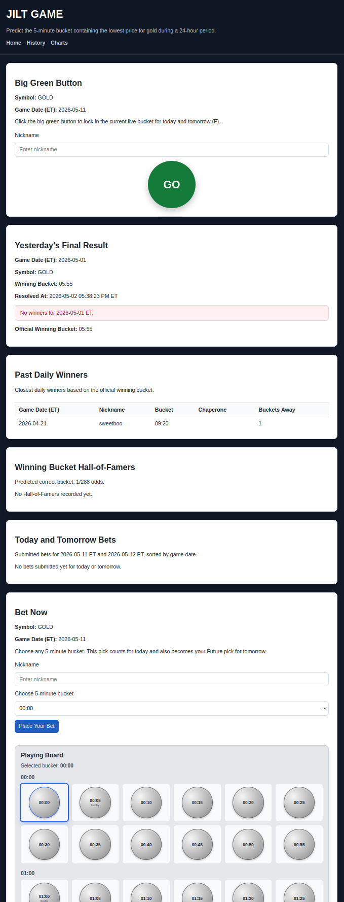

# JILT GAME

A local-first FastAPI game prototype that turns JILT intraday-low analytics into a playable daily bucket-guessing game.

JILT GAME is built on top of **JILT — Jeff’s Intraday Low Toolkit**. The game lets users guess which 5-minute trading bucket will contain gold’s daily low. After JILT processes market data and identifies the winning bucket, JILT GAME can display the result, show guesses, and connect the analytics output to a simple user-facing game experience.

> **JILT finds the result. JILT GAME makes it playable.**

---

## Screenshots

### Home / Bucket Board



---

## Purpose

JILT GAME was created to demonstrate how a backend analytics project can become a user-facing application.

The original JILT project analyzes intraday gold market data and identifies which 5-minute bucket contains the day’s low. JILT GAME uses that output as the basis for a simple prediction game.

The project demonstrates:

- turning analytics output into a web experience
- using FastAPI and Jinja templates for a lightweight browser app
- storing user guesses and daily results in PostgreSQL
- integrating generated JSON result artifacts
- displaying charts produced by the JILT analytics pipeline
- building a local prototype that could later become a hosted public game

---

## Current Project Status

JILT GAME is currently a **working local-first prototype**.

It is designed for local development, testing, and portfolio demonstration. It is not yet a fully hosted public production system.

The current version demonstrates the core game loop:

1. A user selects a 5-minute bucket.
2. The guess is stored with a nickname and game date.
3. JILT produces a daily result artifact.
4. JILT GAME displays the winning bucket and recent results.
5. The app connects JILT-generated charts and result data to the web interface.

A future hosted version could include public deployment, scheduled result ingestion, automated daily data refresh, more polished user handling, and broader public testing.

The current project should be understood as:

> **Current local prototype; future public deployment path identified.**

---

## Repository Structure

This project lives under:

```bash
jilt-game/
```

It is related to the main JILT analytics project under:

```bash
jilt/
```

JILT produces the market result artifacts and charts. JILT GAME consumes those outputs for the web-game interface.

---

## Current Environment

The current environment runs locally and uses:

- Python
- FastAPI
- Jinja templates
- PostgreSQL
- HTML/CSS
- local environment variables
- JILT-generated JSON result artifacts
- JILT-generated chart images

This setup is intended to prove the application flow before moving to a public deployment model.

---

## Intended Future Environment

A future production-style environment may include:

- public web hosting
- managed PostgreSQL or another durable database option
- scheduled JILT data refresh
- automated result ingestion
- static/chart artifact publishing
- improved mobile layout
- stronger user/session handling
- public testing with real users
- optional account, streak, prize, or merch-credit features

---

## Tech Stack

- **Backend:** FastAPI
- **Templates:** Jinja
- **Database:** PostgreSQL
- **Frontend:** HTML, CSS
- **Data artifacts:** JSON
- **Charts:** generated by JILT
- **Source control:** Git / GitHub

---

## Relationship to JILT

JILT GAME depends on output from the main JILT analytics project.

The JILT pipeline is responsible for:

- ingesting intraday market data
- identifying the daily low
- assigning the winning 5-minute bucket
- producing chart artifacts
- writing result data to JSON

JILT GAME is responsible for:

- collecting user guesses
- displaying the board
- showing current bets
- showing daily results
- presenting JILT charts
- turning the analytics output into a game experience

---

## Current Features

The prototype currently includes:

- nickname-based bucket guessing
- 5-minute bucket selection
- daily game-date logic based on Eastern Time
- current bets display
- recent results / past winners display
- JILT result artifact ingestion
- JILT chart display
- heatmap-style bucket board
- chaperone/character mapping for buckets
- local PostgreSQL-backed persistence

---

## Game Concept

Users attempt to predict which 5-minute trading bucket will contain gold’s daily low.

Gold futures trade across a long daily session, so the game uses a full set of 5-minute buckets rather than a simple stock-market open/close window.

The game is intended to make market-pattern analysis more interactive and playful while still being grounded in real data.

---

## Local Setup

> Exact setup may vary depending on local PostgreSQL credentials and environment variables.

From the repository root:

```bash
cd jilt-game
```

Create and activate a Python virtual environment if needed:

```bash
python3 -m venv .venv
source .venv/bin/activate
```

Install dependencies:

```bash
pip install -r requirements.txt
```

Load local environment variables:

```bash
source .env.local
```

If the database password is not stored in `.env.local`, export it manually:

```bash
export JILT_GAME_DB_PASSWORD='your_local_password_here'
```

Run the FastAPI app:

```bash
uvicorn app.main:app --reload
```

Then open the local development URL shown by Uvicorn, usually:

```text
http://127.0.0.1:8000
```

---

## Environment Variables

The app expects local database configuration through `.env.local` and/or exported shell variables.

Example local keys:

```bash
JILT_GAME_DB_HOST=
JILT_GAME_DB_PORT=
JILT_GAME_DB_NAME=
JILT_GAME_DB_USER=
JILT_GAME_DB_PASSWORD=
JILT_RESULTS_PATH=
JILT_CHARTS_DIR=
```

Do not commit real database credentials.

`JILT_GAME_DB_PASSWORD` may be exported manually instead of stored in `.env.local`.

---

## Database

JILT GAME uses PostgreSQL tables separate from the main JILT analytics tables.

The game database is intended to store:

- supported symbols
- daily user guesses
- daily game results

Schema setup is handled through:

```bash
sql/schema.sql
```

Apply the schema to the local PostgreSQL database before running the app.

---

## Result Artifacts

JILT GAME reads result data generated by the main JILT project.

The expected result artifact is a JSON file containing information such as:

- game date
- symbol
- winning bucket
- result timestamp
- data source/version information

This allows the analytics pipeline and the game interface to remain loosely coupled.

---

## Charts

JILT GAME can display charts generated by JILT, including:

- low bucket frequency
- daily low by date
- daily low hour heatmap

These charts help users understand historical patterns while still allowing the game to remain simple and playable.

---

## Current Limitations

JILT GAME is intentionally limited at this stage.

Current limitations include:

- local-first prototype only
- no public hosting yet
- no full user account system
- nickname-based play only
- daily result refresh is not fully automated
- JILT data/chart refresh currently requires local/manual workflow
- no production-grade authentication or authorization
- no payment, prize, or merch-credit system
- not currently intended as a public production service

---

## Deployment Status

JILT GAME is currently not treated as a live cloud-hosted production service.

The project is being preserved as a local-first portfolio prototype while the broader cloud portfolio is being reviewed for cost control. Public deployment and scheduled automation remain possible future steps, but the current priority is to preserve the working prototype, documentation, screenshots, and project architecture without creating unnecessary cloud cost.

---

## Future Improvements

Possible future improvements include:

- public hosting
- automated daily result refresh
- scheduled ingestion from JILT
- improved mobile layout
- account-based users instead of nickname-only play
- better game history pages
- more polished board interaction
- stronger visual identity
- daily streaks
- prize or merch-credit mechanics
- admin tools for results and bucket/chaperone updates
- automated chart refresh
- deployment documentation

---

## Portfolio Value

JILT GAME demonstrates the ability to take a backend data project and extend it into an interactive web application.

It shows practical experience with:

- Python web development
- FastAPI
- PostgreSQL
- SQL-backed application design
- local environment management
- artifact-driven integration between projects
- chart/result presentation
- game-style user interaction
- incremental product development

The project is intentionally practical, local-first, and expandable.
