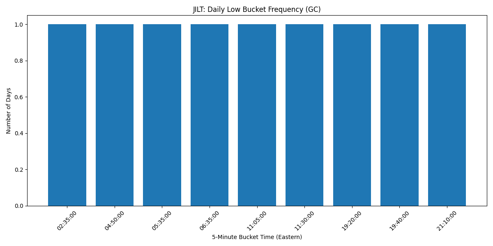

# JILT — Jeff’s Intraday Low Toolkit

JILT is a local-first Python and PostgreSQL analytics project that analyzes historical intraday market data to determine which 5-minute bucket most often contains a symbol’s daily low.

I built this project to practice SQL, relational schema design, market-data normalization, derived-summary workflows, and operator-readable reporting through a real working system rather than isolated exercises.

Instead of treating SQL as an abstract lesson, JILT uses an end-to-end pipeline: fetch historical intraday data, normalize timestamps and trading dates, store raw bars in PostgreSQL, derive one daily-low result per trading day, summarize low-bucket frequency, and generate a chart artifact for review.

---

## Example Output

### Low-bucket frequency chart



### Daily low by date chart


### Daily low hour heatmap


---

## Project Goals

JILT was built to demonstrate:

- Python and PostgreSQL integration
- practical SQL schema design
- historical intraday market-data ingestion
- derived summary-table workflows
- time-zone-aware data normalization
- local CLI-based analytics workflow design
- operator-readable terminal reporting
- saved chart artifact generation
- structured project evolution from MVP to future expansion

---

## Current v1 Scope

JILT v1 is intentionally focused and local-first.

**Current scope**

- symbol: gold
- data source: Yahoo Finance
- mode: historical only
- granularity: 5-minute bars
- raw retention: 30 days
- outputs: terminal reports and saved chart artifacts
- database: PostgreSQL
- environment: local Linux
- execution style: CLI / one-command workflow

This version is designed to prove the system end to end before adding broader symbol support, cloud deployment, or dashboard publishing.

---

## What JILT Does

At a high level, JILT performs the following pipeline:

1. Fetch recent historical 5-minute market data for gold
2. Normalize timestamps into Eastern Time
3. Derive `trade_date` from the normalized timestamp
4. Insert raw bars into PostgreSQL with duplicate protection
5. Derive one daily-low result per trading day
6. Store daily-low summaries in a separate summary table
7. Produce terminal reports showing daily low results and low-bucket frequency
8. Save a low-bucket frequency chart
9. Save a daily-low-by-date chart
10. Save a daily-low hour heatmap

---

## Architecture Overview

JILT uses a simple local architecture with a clean separation between raw data, derived summaries, reporting, and artifacts.

**Core layers**

- **Python application layer** for ingestion, orchestration, reporting, and charting
- **PostgreSQL storage layer** for raw intraday bars and derived daily summaries
- **CLI entrypoint** for full runs and targeted modes
- **Chart artifact output** for saved visual analysis

---

## Database Design

JILT currently uses three tables.

### `symbols`

Reference table for tracked symbols.

**Purpose**

- store symbol metadata
- support future expansion beyond a single symbol
- keep analysis tables normalized

### `intraday_bars`

Raw historical 5-minute bar data.

**Purpose**

- store normalized market bars for analysis
- preserve raw analytical input
- support retention and re-derivation workflows

**Key characteristics**

- one row per symbol and timestamp
- duplicate protection via a unique constraint on `(symbol_id, bar_timestamp)`
- timestamps stored as `TIMESTAMPTZ`

### `daily_low_summary`

Derived table containing one result per symbol per trading day.

**Purpose**

- store the lowest price of the day
- store the exact 5-minute bucket that contained the daily low
- support fast reporting and chart generation

---

## SQL / Analysis Approach

JILT answers its main question in two stages.

### Stage 1: Daily low derivation

From the raw 5-minute bars, JILT finds the single bar per trading day that contains the day’s lowest `low_value`.

This is done with SQL window logic that ranks bars per symbol and trade date by:

1. lowest price
2. earliest timestamp in the event of a tie

That result is stored in `daily_low_summary`.

### Stage 2: Low-bucket frequency analysis

From `daily_low_summary`, JILT groups by `low_bucket_time` and counts how often each 5-minute bucket was the daily winner.

This produces the core analytical output of the project: which 5-minute bucket most often contains the daily low.

---

## Current Project Structure

```text
jilt/
├── app/
│   ├── chart_daily_low_by_date.py
│   ├── chart_daily_low_hour_heatmap.py
│   ├── chart_low_bucket_frequency.py
│   ├── config.py
│   ├── db.py
│   ├── ingest_gold.py
│   ├── main.py
│   ├── market_data.py
│   ├── refresh_daily_low_summary.py
│   ├── report_daily_lows.py
│   ├── report_low_bucket_frequency.py
│   ├── retention.py
│   ├── test_db.py
│   └── test_market_data.py
├── charts/
├── data/
├── docs/
└── sql/
    ├── schema.sql
    └── seed.sql
```

---

## How to Run

From the `jilt/` project directory:

```bash
source .venv/bin/activate
source .env.local
export JILT_DB_PASSWORD='your_real_password_here'
python -m app.main
```

This performs the full JILT pipeline:

- ingest raw intraday bars
- refresh daily low summary
- print the daily low report
- print the low-bucket frequency report
- save the low-bucket frequency chart
- save the daily-low-by-date chart
- save the daily-low hour heatmap

---

## CLI Modes

JILT supports targeted execution modes through `app.main`.

### Full pipeline

```bash
python -m app.main
```

### Individual modes

```bash
python -m app.main --mode ingest
python -m app.main --mode refresh-summary
python -m app.main --mode retention
python -m app.main --mode report-daily
python -m app.main --mode report-frequency
python -m app.main --mode chart-frequency
python -m app.main --mode chart-date
python -m app.main --mode chart-heatmap
```

This makes the project easier to test, debug, and operate as a real tool rather than a single monolithic script.

---

## Environment Variables

JILT uses environment-driven configuration for runtime behavior.

**Common settings**

- `JILT_DB_HOST`
- `JILT_DB_NAME`
- `JILT_DB_USER`
- `JILT_DB_PASSWORD`
- `JILT_MARKET_TIMEZONE`
- `JILT_SYMBOL`
- `JILT_YFINANCE_TICKER`
- `JILT_HISTORY_PERIOD`
- `JILT_INTERVAL`
- `JILT_RAW_RETENTION_DAYS`

This keeps runtime settings separate from source code and leaves room for later expansion.

---

## Output Artifacts

JILT currently produces:

- terminal daily low report
- terminal low-bucket frequency report
- saved chart artifacts

**Current chart outputs**

```text
charts/low_bucket_frequency.png
charts/daily_low_by_date.png
charts/daily_low_hour_heatmap.png
```

This chart shows how often each 5-minute bucket contained the daily low across the currently analyzed days.

---

## What This Project Demonstrates

JILT is meant to show more than “I wrote a Python script.”

It demonstrates that I can:

- design a normalized relational schema for a real use case
- connect Python application logic to PostgreSQL cleanly
- ingest and normalize external time-series data
- use SQL window logic to derive analytical summaries
- build operator-readable workflows and CLI modes
- enforce duplicate protection and retention behavior
- produce both terminal and chart-based outputs from derived data
- iterate from rough proof-of-concept scripts into a cleaner, modular project structure

---

## Why This Project Matters

My other portfolio projects focus heavily on AWS, containerized automation, scheduling, observability, and cloud operations.

JILT adds a different but complementary dimension to that portfolio:

- local-first analytics tooling
- practical SQL development
- relational data modeling
- time-series normalization
- summary derivation and reporting

It shows that I can work across both infrastructure-oriented automation and data-oriented application design.

---

## Current Limitations

JILT v1 is intentionally narrow.

**Current limitations**

- single-symbol workflow
- local-first execution only
- no dashboard publishing yet
- no cloud deployment yet
- no automatic multi-symbol registration yet
- current historical window depends on intraday data availability from the data source

These constraints are deliberate for version 1 so the system stays clean and explainable.

---

## Future Enhancements

Potential future directions include:

- runtime symbol selection
- automatic symbol registration in the `symbols` table
- multi-symbol analysis workflows
- broader historical analysis windows
- dashboard-oriented artifact publishing
- optional cloud or container deployment model
- expanded charting and artifact history

---

## Summary

JILT is a local-first Python/PostgreSQL analytics tool that turns historical intraday market data into a structured SQL-backed workflow for daily low analysis, frequency reporting, and chart generation.

Within this portfolio, its role is to demonstrate practical SQL and data-workflow engineering through a real project with a usable operator interface, not just isola
